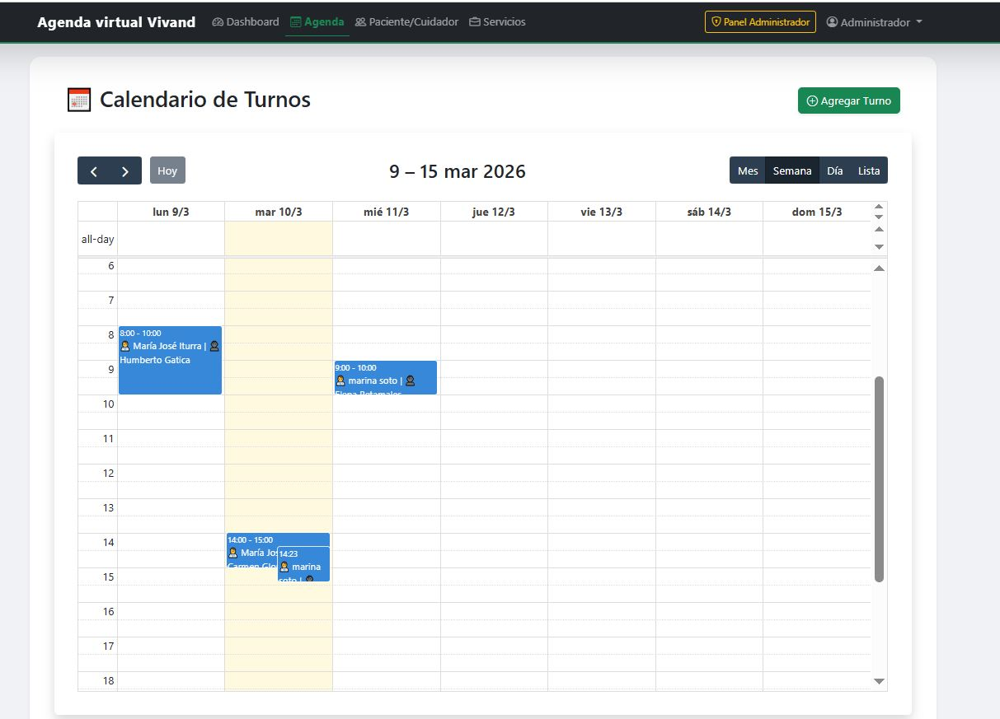

# Vivand - Gestión de Cuidados Integrales 🩺

Sistema de gestión de turnos y ficha clínica digital diseñado para servicios de cuidados a domicilio y pequeñas empresas de salud, adaptable a veterinarias, servicios estéticos u otros servicios que requieran agenda. Este MVP permite coordinar pacientes, cuidadores y servicios de manera eficiente, además de mensajes instantáneos de confirmación o cancelación de cita vía WhatsApp.

<p align="center">
  
</p>

## 🚀 Características principales

* **Dashboard Estadístico:** Visualización de ingresos mensuales y servicios realizados.
* **Gestión de Turnos:** Agenda interactiva con visualización de calendario.
* **Notificaciones Automáticas:** Confirmación de turnos vía **WhatsApp** mediante la API de **UltraMsg**.
* **Reportes en Excel:** Generación de Fichas Médicas por paciente y reportes de pagos para cuidadores.
* **Arquitectura:** Backend robusto desarrollado con **Django** y base de datos **PostgreSQL**.
* **Interfaz Moderna:** Diseño profesional enfocado en la experiencia de usuario (Mobile First).

## 📱 Vista Previa (Mobile First)

Para este proyecto, se priorizó la usabilidad en dispositivos móviles, permitiendo que los profesionales gestionen sus turnos desde cualquier lugar con una interfaz adaptativa.

<p align="center">
  
  
</p>

## 📊 Gestión de Reportes (Excel)

El sistema facilita la administración de datos mediante la exportación de información clave. Esto incluye la generación de fichas clínicas digitales para pacientes y el desglose de honorarios para los cuidadores.

<p align="center">
  
</p>

## 💬 Integración con WhatsApp

Utilizando la API de **UltraMsg**, el sistema automatiza las comunicaciones, enviando alertas de confirmación o recordatorios directamente al teléfono del usuario.

<p align="center">
  
  
</p>

---

## 🛠️ Tecnologías utilizadas

* **Backend:** Python 3.x, Django 5.x
* **Base de Datos:** PostgreSQL
* **Mensajería:** API de UltraMsg (Integración vía `requests`)
* **Reportes:** Openpyxl (Generación de archivos .xlsx)
* **Frontend:** HTML5, CSS (Tailwind CSS), JavaScript (FullCalendar)

## 📦 Instalación y Configuración

1. **Clonar el repositorio:**
   ```bash
   git clone [https://github.com/Mpradinesa/Vivand.git](https://github.com/Mpradinesa/Vivand.git)
   cd vivand